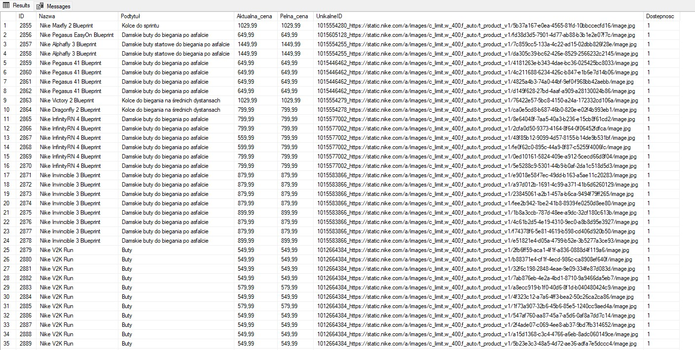

# Moje repozytorium
Projekt zawiera API do pobierania danych dotyczących butów damskich, męskich i dziecięcych ze strony nike.com

# Wyniki działania API

API wysyła zapytania i zwraca wyniki do mojej bazy danych, zawierając informację o Nazwie, Podtytule, Aktualnej_cenie, Pełnej_cenie danego produktu obuwniczego ze strony NIKE.

Jak widać na załączonym obrazku udało się pobrać 3356 produktów w aktualnej sprzedaży na stronie nike.com. 

Dodatkowo dla lepszej widoczności wypisano liczbę produktów w danej kategorii na podstawie słów kluczowych "męski, damski, dzieci" oraz liczbę produktów, które nie spełniają żadnej z tych reguł.

Dla lepszego zobrazowania wyników wyselectowano przykładowe produkty w danej kategorii.

# Poszerzenie scrapingu

Kod został poszerzony o pobieranie danych dotyczących dostępności produktu na stronie nike.com

Niestety NIKE nie udostępnia konkretnych informacji dotyczących posiadanej ilości sztuk. W związku z tym opieram się aktualnie na binarce 0/1 = niedostępne/dostępne.

# Nowe unikalne ID

Analiza wykazała, że niestety JSON z API Nike nie udostępnia unikalnych ID produktów, jednak najwięcej unikalnych produtków udało się odnależć na podstawie połączenia kolumn PID + portraitURL.

W związku z tym aktualnie w bazie danych przechowywane są wyłącznie produkty o "unikalnym" ID. 

Aktualnie moja aplikacja pobiera dane nowych produktów, w przypadku kiedy produkt istnieje w tabeli (na podstawie kolumny UnikalneID) zmienione kolumny są aktualizowane. 

